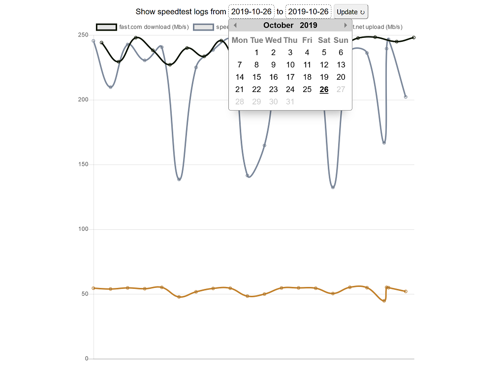

# internet-speed-logger
Run internet speed tests periodically.
The tests are run at user set interval (or by default, every 15 minutes), using [speedtest-net](https://www.npmjs.com/package/speedtest-net) and [fast-speedtest-api](https://www.npmjs.com/package/fast-speedtest-api) npm packages (taking turns between packages). The results are stored into sqlite database file and can be displayed with included web UI.

### Requirements:
Node.js / Docker

### Running with Node:
``npm install``

``npm start``

### Running with Docker
https://hub.docker.com/r/vkentta/internet-speed-logger

``docker run -e CHECK_PERIOD_MINUTES=15 -v `pwd`:"/usr/src/app/data" -p 3000:3000 --name internet-speed-logger --restart always vkentta/internet-speed-logger``

The database file will be added to / used from the directory you run the above command in.

##### Building with docker

``docker build -t your-custom-tagname .``

##### Running your own image

``docker run -v `pwd`:"/usr/src/app/data" -p 3000:3000 --name internet-speed-logger --restart always your-custom-tagname``

### Displaying speed test results:
After the speed tests have been running for a while, go to [localhost:3000](http://localhost:3000).

